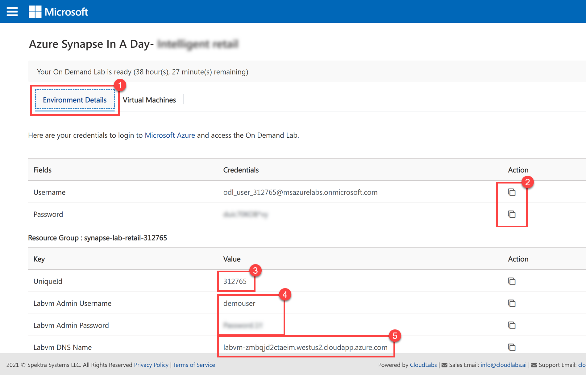
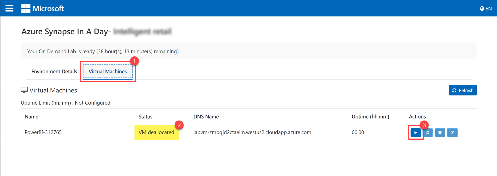

# Azure Synapse in a day demos - Fraud detection

## Overview

Over the past few years, there has been a significant worldwide increase in the unauthorized use of credit cards in mail order and online payments, as these are transactions in which no credit card is actually presented to the vendor. Unless some sort of countermeasures are taken, this will cause enormous damage to credit card users and credit card companies.

### The Challenge for Businesses

In order to prevent unauthorized use, it is crucial to be able to infer the possibility of unauthorized transactions and to detect fraud from transaction details. We also recognize that the prompt identification of unauthorized transactions is an urgent issue for credit card companies and financial institutions.

They need to be able to quickly understand and analyze the trends of unauthorized spending for each time period and the geographical characteristics of unauthorized use, and to learn how to take concrete preventive measures.

### Objectives and Goals

In this hands-on training, we will learn specific methods for using the SQL On-Demand feature in Azure Synapse Analytics to convert credit card fraud detection data and of geographical characteristics data that have been deployed in CSV format into Azure Data Lake Storage Gen2 into data, without any program development. You will also learn how to conduct sophisticated analysis of this data using Power BI reports.

In Exercise 1, we will explore the trends of unauthorized spending for each time period, as observed from the fraud detection results extracted by machine learning.

In Exercise 2, we will explore the geographical characteristics of unauthorized use, as observed from data that combines latitude/longitude information of the cities in which credit cards have been used.

### How to get started with a provided lab environment

1. If you are using a hosted CloudLabs lab environment, you will find your environment details in the email address you provided during registration. You can also find the information by selecting the **Environment Details** tab **(1)** on the landing page for the `Azure Synapse in A Day - Fraud detection` lab.

   Use the buttons **(2)** to copy your username and password when prompted to log in to the Azure portal and Power BI account. The **UniqueId (3)** is referenced throughout the lab guide and is used as part of resource naming for the Azure artifacts. When you need to sign in to the lab VM, use the provided **VM username and password (4)** after connecting to the **VM DNS name (5)** with your remote connection application, such as RDP.

2. When you need to log in to the lab VM, select the **Virtual Machines** tab **(1)** and check the VM status **(2)**. If the VM is **deallocated**, you must start it by selecting the **Start** button **(3)** under Actions.

