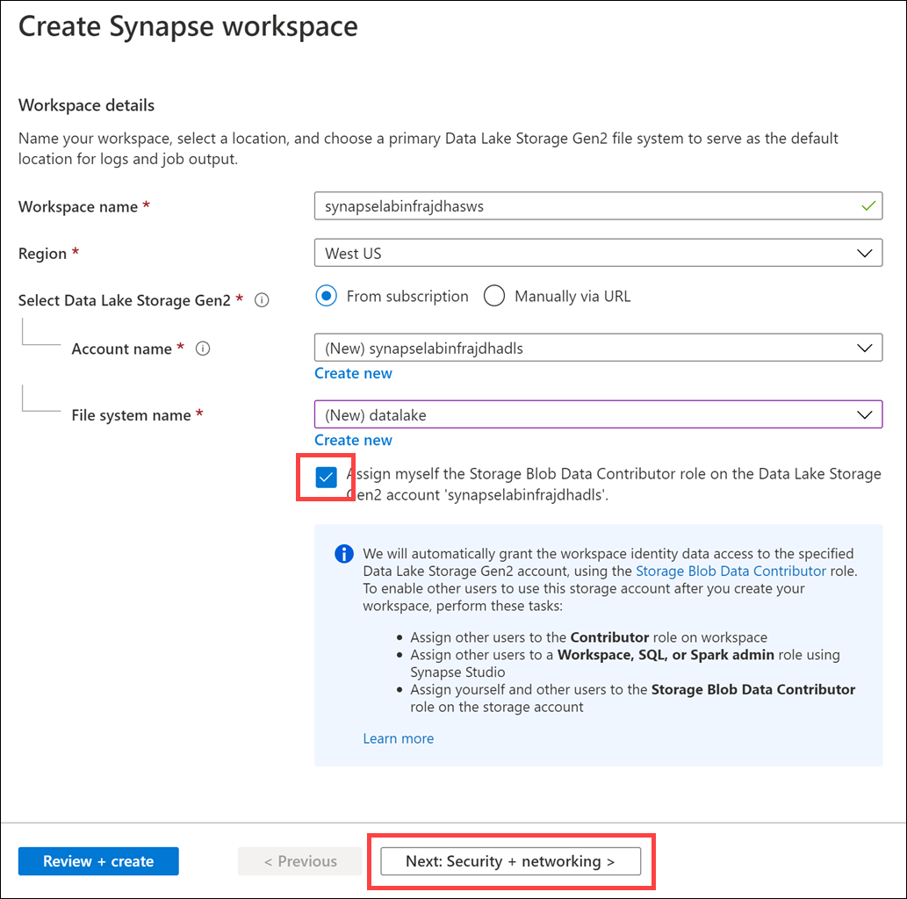
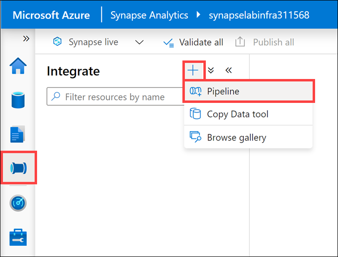
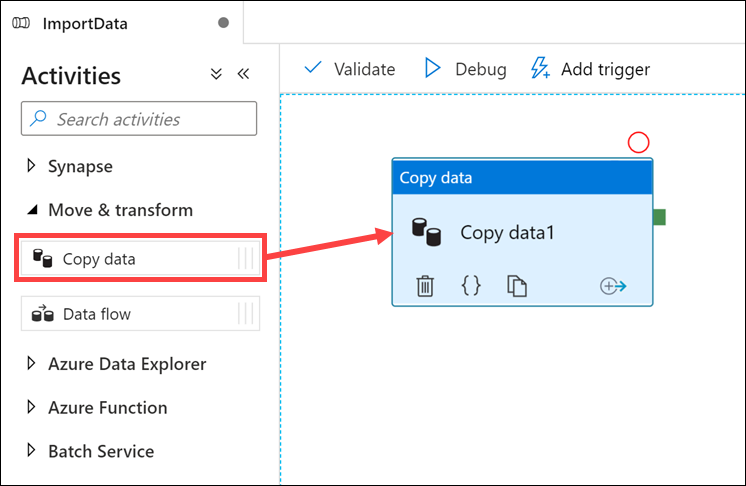
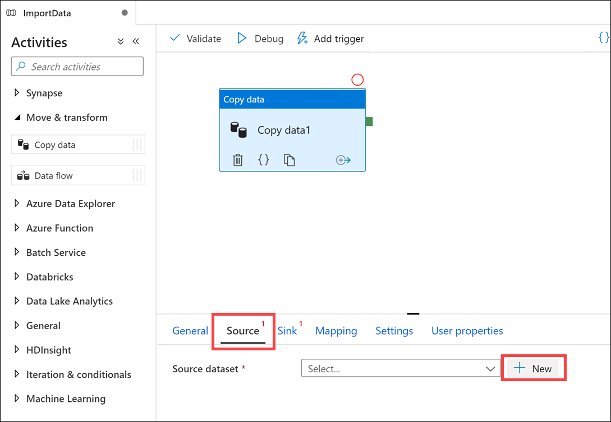
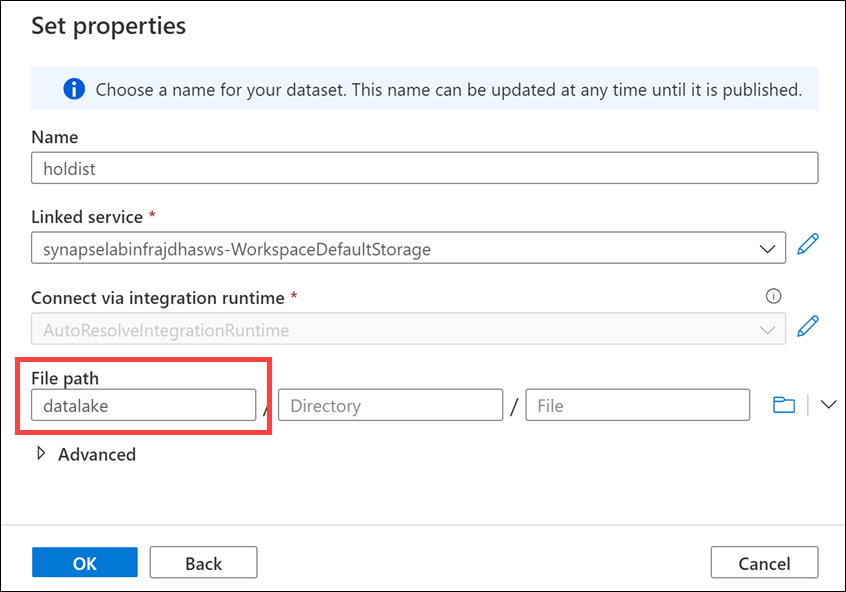
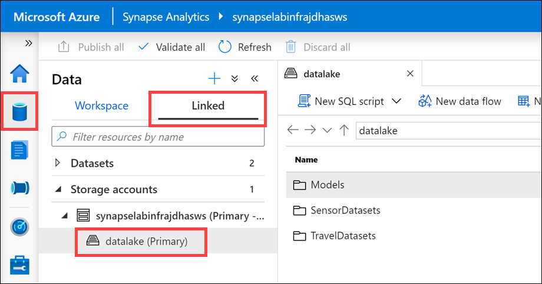

# Azure Synapse in a day demos - Infrastructure

## Overview

This is a hands-on lab for infrastructure, telecommunications, transportation, and manufacturing using Azure Synapse Analytics. It provides step-by-step procedures for basic analysis platform construction, IoT sensor data visualization, and predictive maintenance features.

## Building analytic solutions with Azure Synapse Analytics (Basic)

### About the latest data analysis infrastructure

The modern data analytics infrastructure, called the Modern Data Warehouse pattern, is based on the following points to address big data:

* Scalability

    By focusing on a managed infrastructure of PaaS, scalability that is difficult to get on-premises can be achieved. By incorporating a distributed processing infrastructure such as Spark, data processing in petabytes can be performed quickly.

* Use of data lakes

    The data lake accumulates unstructured data, such as JSON and image data. By implementing structured processing by distributed processing, visualization of data that has been difficult to use in the past and the use of AI will be promoted.

In traditional Azure data analytic infrastructures, the solution was for architects to combine PaaS such as Azure Data Factory, Azure Databricks, Azure SQL Data Warehouse, and Azure Data Lake Storage to accommodate a variety of workloads.

Traditional Azure analytic infrastructure configuration

> TODO: Update image

With Azure Synapse Analytics, enjoy advantages of traditional scalable cloud data analytic infrastructures while:

* Building analytical infrastructures more quickly
* Reducing infrastructure complexity
* Reducing costs and improving development efficiency with integrated workspace and management screen

Azure Synapse Analytics

> TODO: Update image

### Scenario

Build a flight delay visualization solution. With Azure Synapse Analytics, an analytic infrastructure can be built in a short time frame.

This lab will guide you through the basic deployment of Azure Synapse Analytics and creating DWH, and practicing GUI-based distributed ETL processing and reporting.

### Hands-on architecture

You will configure an architecture such as the following:

> TODO: Update image

To build the architecture, complete the following tasks:

1. Deploy Azure Synapse Analytics
2. Create a link between flight delay data in the data lake
3. Create a SQL Pool
4. Create distributed ETL processing in the GUI with Mapping Data Flow
5. Visualize flight delay

## Exercise 0: Download lab files

The lab files are located in a GitHub repo. You must unzip the file and extract it to your desktop so you can access them throughout the lab.

1. Download the ZIP file for the lab from <https://github.com/solliancenet/azure-synapse-in-a-day-demos/archive/master.zip>.

2. Extract the files to **`C:\`**. This will create a folder named `azure-synapse-in-a-day-demos-master` at the root of your C: drive.

     Folders")

3. 

## Exercise 1: Deploy Azure Synapse Analytics

Time required: 10 minutes

The first step is to deploy and configure the resources. It's easy to do from the Azure Portal.

> TODO: Update image

### Task 1: Create Azure Synapse Analytics workspace

1. Navigate to the Azure portal (<https://portal.azure.com>) to create the Azure Synapse Analytics workspace.

2. In the search menu, type **Synapse**, then select **Azure Synapse Analytics (workspaces preview)**.

    

3. Select **Add**.

    

4. In the `Create Synapse workspace` form, enter the values shown in the table below. For the Azure Data Lake Storage Gen2 account name, select **Create new**, enter the account name, then select **OK**.

    

    | Parameters | Settings | Remarks |
    | --- | --- | --- |
    | Subscription | Any | Select the Azure subscription used for this lab. |
    | Resource group | `synapse-lab-infrastructure` | Select **Create new**, then enter the name. |
    | Workspace name | `synapselabinfra` + your initials + `asws` (example: `synapselabinfrajdhasws`) | Lowercase alphanumeric characters only |
    | Region | Select the region closest to you, such as `West US`. | |
    | Select Data Lake Storage Gen2 | From subscription | Default settings |
    | Account name | `synapselabinfra` + your initials + `adls` (example: `synapselabinfrajdhadls`) | Select **Create new** (lowercase alphanumeric characters only) |

5. Select **Create new** for `File system name`, type **datalake** in the name field, then select **OK**.

    

6. Check the `Assign myself the Storage Blob Data Contributor role` checkbox, then select **Next: Security and networking**.

    

7. Review the settings, then select **Review + create**.

    

8. Review the settings, then select **Create**. It takes around five minutes to create the workspace.

    

### Task 2: Log in to Synapse Studio

1. When the Azure Synapse Analytics workspace deployment completes, navigate to the resource. You can do this either by selecting **Go to resource** in the deployment completion dialog, or by navigating to the `synapse-lab-infrastructure` resource group and selecting the workspace within.

2. In the **Overview** blade, select the **Workspace web URL** to navigate to Synapse Studio for this workspace.

    

    After authenticating your account, you should see the Synapse Studio home page for your workspace.

    

3. If you see the Getting started dialog, select **Close**.

    

## Exercise 2: Moving data to the data lake using Copy activity

Time required: 30 minutes

In this exercise, you will import a large amount of data into the primary data lake account.

> TODO: Update image

### About Synapse Pipeline

The data integration feature, Synapse Pipeline, is designed with the following concepts:

* **Linked Service**: Contains definitions about the connection, such as the database and server information.
* **Dataset**: Browses the Linked Service and defines table information, for example.
* **Activity**: Browses, for example, a Dataset to define processing such as data movement.
* **Pipeline**: Defines the order and conditions in which Activities are run.
* **Integration Runtime**: Defines the processing infrastructure used by Linked Services and Activities.
* **Trigger**: Defines when and how the Pipeline will run.

### Task 1: Create a Linked Service

1. Select the **Manage** hub, **Linked services**, then select **+ New**.

    

2. Select **Azure Blob Storage**, then select **Continue**.

    

3. Enter each setting described below, then select **Test connection**. When the connection is successful, select **Create**.

    

    | Parameters | Settings | Remarks |
    | --- | --- | --- |
    | Name | `HOLSource` | |
    | Description | No entry required | Default settings |
    | Connect via integration runtime | AutoResolveIntegrationRuntime | Default settings |
    | Authentication method | SAS URL | |
    | SAS URL | `https://solliancepublicdata.blob.core.windows.net` | |
    | SAS token| '' | Enter two single quotes |
    | Test connection | To linked service | Default settings |

### Task 2: Create a Copy pipeline

1. Select the **Orchestrate** hub, select **+**, then select **Pipeline**.

    

2. For **Name**, enter `ImportData`, then select **Properties** to close the dialog.

    

3. Expand **Move & transform** under the Activities menu. Drag and drop the **Copy data** activity onto the canvas area to the right.

    

4. Select the **Source** tab, then select **+ New** next to the source dataset.

    

5. Select **Azure Blob Storage**, then select **Continue**.

    

6. Select the **Binary** format, then select **Continue**.

    

7. Enter each setting as displayed in the table below, and then select **OK**.

    

    | Parameters | Settings | Remarks |
    | --- | --- | --- |
    | Name | `holsource` | Be careful not to include extra spaces when copying |
    | Linked service | HOLSource | Select the linked service you created earlier |
    | File path | `synapse-in-a-day/infrastructure` | Enter `synapse-in-a-day` in the first field, and `infrastructure` in the second field. *Note*: you may see an error if you try to browse, due to the lack of list permissions on the entire public data source. To review the contents, select the drop down arrow and select "From specified path" |

8. Select the **Sink** tab, then select **+ New** next to the sink dataset.

    

9. Select **Azure Data Lake Storage Gen2**, then select **Continue**.

    

10. Select the **Binary** format, then select **Continue**.

    

11. Enter each setting as displayed in the table below, and then select **OK**.

    

    | Parameters | Settings | Remarks |
    | --- | --- | --- |
    | Name | `holdist` | Be careful not to include extra spaces when copying |
    | Linked service | Select the default storage for your workspace (`<Synapse workspace name>-WorkspaceDefaultStorage`) | |
    | File path | `datalake` | Enter `datalake` in the first field |

12. Select **Publish all**, then select **Publish** in the dialog.

    

    > ※	For the remainder of the lab, select **Publish** as appropriate to save your work.

13. Select **Add trigger**, then select **Trigger now**.

    

14. Select **OK** to run the trigger.

    

15. Select the **Monitor** hub, then **Pipeline runs**. If the pipeline run status is `Succeeded` after a few minutes, then the pipeline run successfully completed.

    

16. Select the **Data** hub, select the **Linked** tab, expand storage accounts, then select **datalake** underneath the primary storage account. You will see the imported data on the right-hand side.

    
