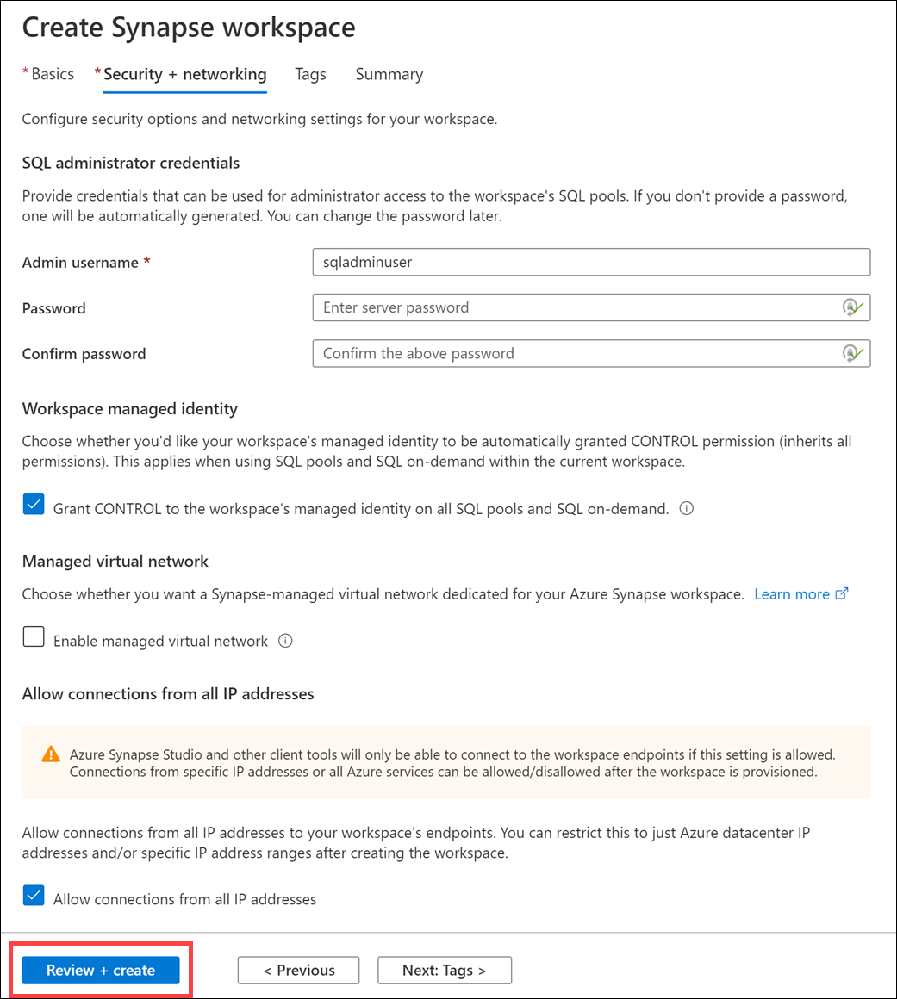
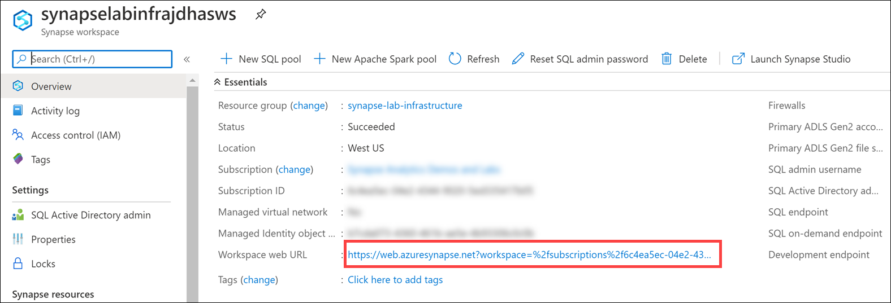
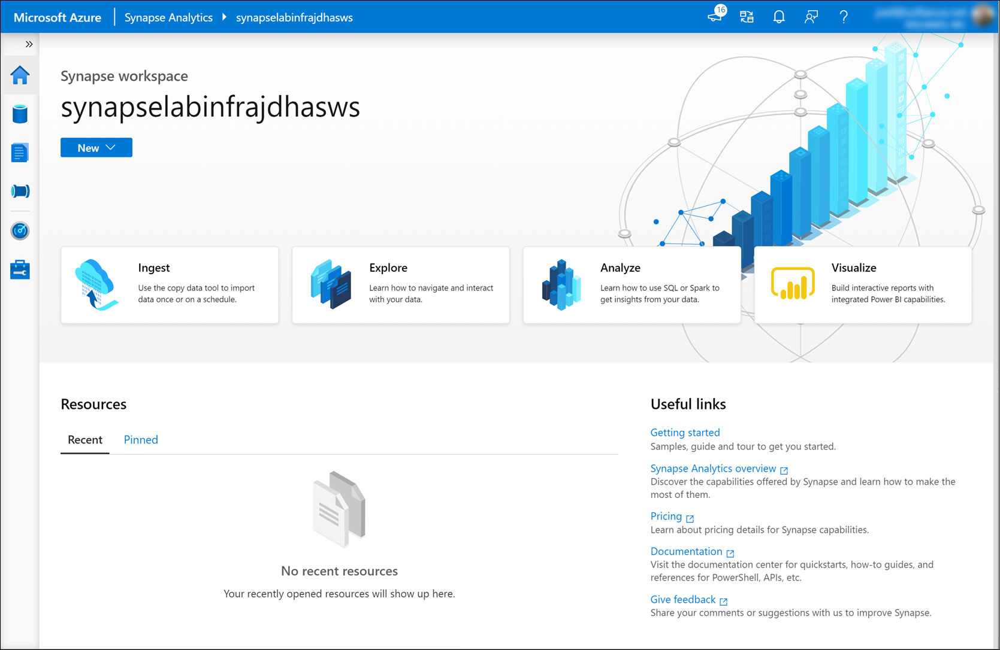

# Azure Synapse in a day demos - Infrastructure

## Overview

This is a hands-on lab for infrastructure, telecommunications, transportation, and manufacturing using Azure Synapse Analytics. It provides step-by-step procedures for basic analysis platform construction, IoT sensor data visualization, and predictive maintenance features.

## Building analytic solutions with Azure Synapse Analytics (Basic)

### About the latest data analysis infrastructure

The modern data analytics infrastructure, called the Modern Data Warehouse pattern, is based on the following points to address big data:

* Scalability

    By focusing on a managed infrastructure of PaaS, scalability that is difficult to get on-premises can be achieved. By incorporating a distributed processing infrastructure such as Spark, data processing in petabytes can be performed quickly.

* Use of data lakes

    The data lake accumulates unstructured data, such as JSON and image data. By implementing structured processing by distributed processing, visualization of data that has been difficult to use in the past and the use of AI will be promoted.

In traditional Azure data analytic infrastructures, the solution was for architects to combine PaaS such as Azure Data Factory, Azure Databricks, Azure SQL Data Warehouse, and Azure Data Lake Storage to accommodate a variety of workloads.

Traditional Azure analytic infrastructure configuration

> TODO: Update image

With Azure Synapse Analytics, enjoy advantages of traditional scalable cloud data analytic infrastructures while:

* Building analytical infrastructures more quickly
* Reducing infrastructure complexity
* Reducing costs and improving development efficiency with integrated workspace and management screen

Azure Synapse Analytics

> TODO: Update image

### Scenario

Build a flight delay visualization solution. With Azure Synapse Analytics, an analytic infrastructure can be built in a short time frame.

This lab will guide you through the basic deployment of Azure Synapse Analytics and creating DWH, and practicing GUI-based distributed ETL processing and reporting.

### Hands-on architecture

You will configure an architecture such as the following:

> TODO: Update image

To build the architecture, complete the following tasks:

1. Deploy Azure Synapse Analytics
2. Create a link between flight delay data in the data lake
3. Create a SQL Pool
4. Create distributed ETL processing in the GUI with Mapping Data Flow
5. Visualize flight delay

## Exercise 1: Deploy Azure Synapse Analytics

Time required: 10 minutes

The first step is to deploy and configure the resources. It's easy to do from the Azure Portal.

> TODO: Update image

### Task 1: Create Azure Synapse Analytics workspace

1. Navigate to the Azure portal (<https://portal.azure.com>) to create the Azure Synapse Analytics workspace.

2. In the search menu, type **Synapse**, then select **Azure Synapse Analytics (workspaces preview)**.

    

3. Select **Add**.

    

4. In the `Create Synapse workspace` form, enter the values shown in the table below. For the Azure Data Lake Storage Gen2 account name, select **Create new**, enter the account name, then select **OK**.

    

    | Parameters | Settings | Remarks |
    | --- | --- | --- |
    | Subscription | Any | Select the Azure subscription used for this lab. |
    | Resource group | `synapse-lab-infrastructure` | Select **Create new**, then enter the name. |
    | Workspace name | `synapselabinfra` + your initials + `asws` (example: `synapselabinfrajdhasws`) | Lowercase alphanumeric characters only |
    | Region | Select the region closest to you, such as `West US`. | |
    | Select Data Lake Storage Gen2 | From subscription | Default settings |
    | Account name | `synapselabinfra` + your initials + `adls` (example: `synapselabinfrajdhadls`) | Select **Create new** (lowercase alphanumeric characters only) |

5. Select **Create new** for `File system name`, type **datalake** in the name field, then select **OK**.

    

6. Check the `Assign myself the Storage Blob Data Contributor role` checkbox, then select **Next: Security and networking**.

    

7. Review the settings, then select **Review + create**.

    

8. Review the settings, then select **Create**. It takes around five minutes to create the workspace.

    

### Task 2: Log in to Synapse Studio

1. When the Azure Synapse Analytics workspace deployment completes, navigate to the resource. You can do this either by selecting **Go to resource** in the deployment completion dialog, or by navigating to the `synapse-lab-infrastructure` resource group and selecting the workspace within.

2. In the **Overview** blade, select the **Workspace web URL** to navigate to Synapse Studio for this workspace.

    

    After authenticating your account, you should see the Synapse Studio home page for your workspace.

    

3. If you see the Getting started dialog, select **Close**.

    