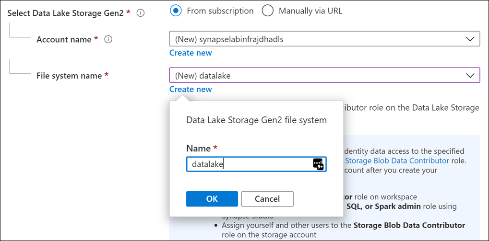
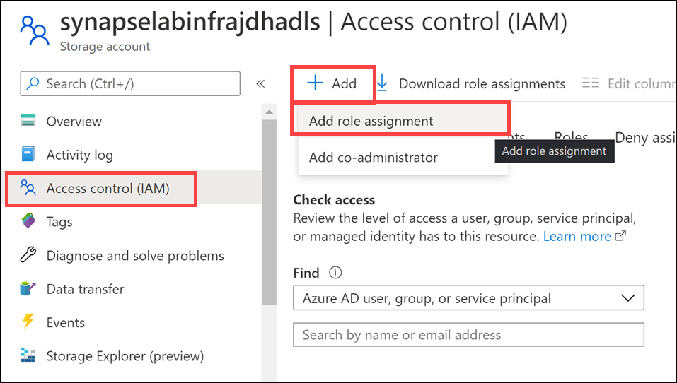
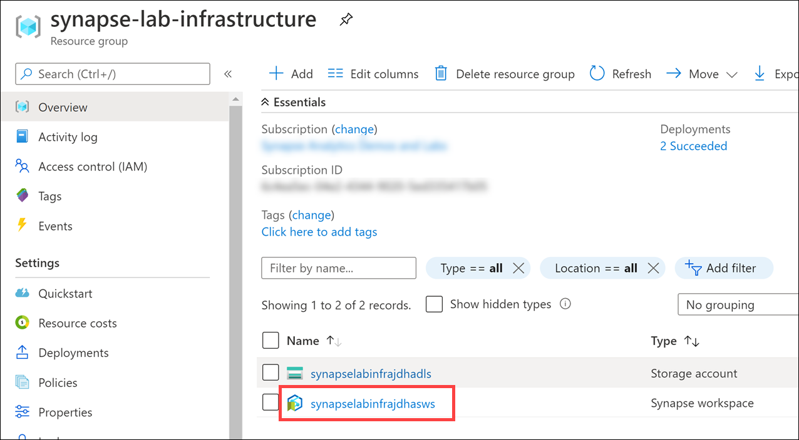
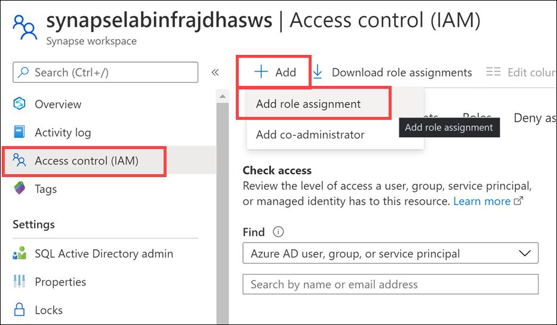
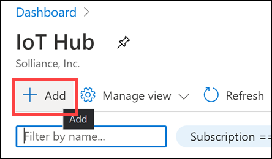
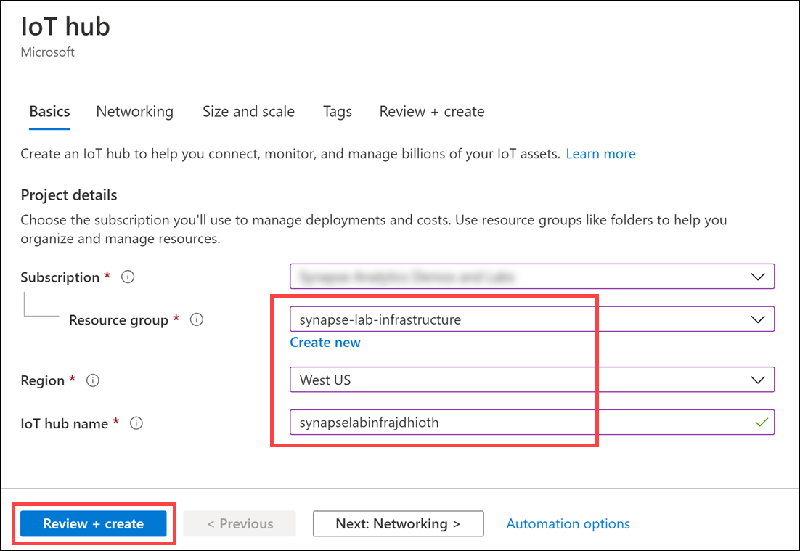
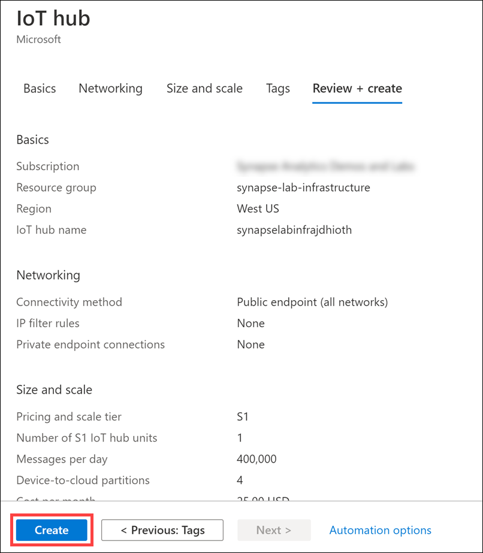
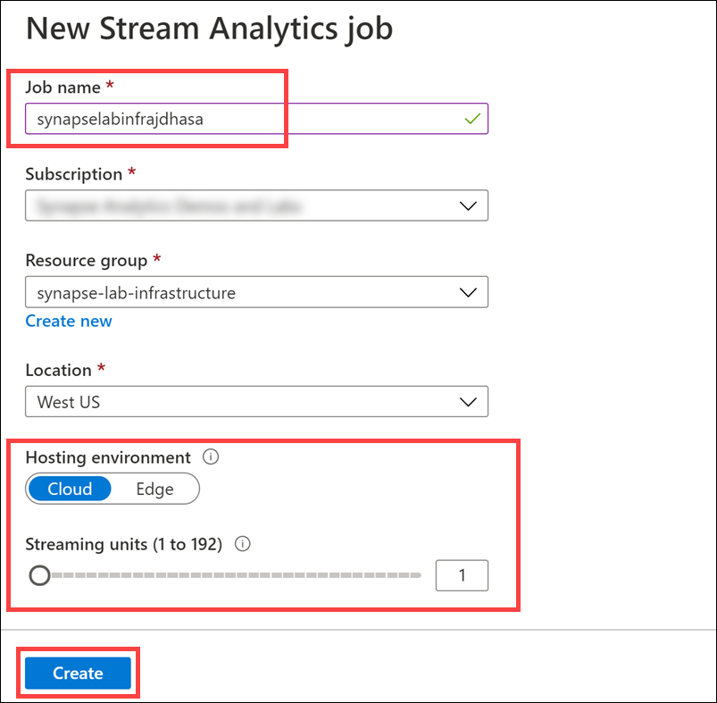

# Azure Synapse in a day demos - Infrastructure

- [Azure Synapse in a day demos - Infrastructure](#azure-synapse-in-a-day-demos---infrastructure)
  - [Pre-requisites](#pre-requisites)
  - [Exercise 0: Download lab files](#exercise-0-download-lab-files)
  - [Exercise 1: Deploy Azure Synapse Analytics](#exercise-1-deploy-azure-synapse-analytics)
    - [Task 1: Create Azure Synapse Analytics workspace](#task-1-create-azure-synapse-analytics-workspace)
    - [Task 2: Set up blob data owner](#task-2-set-up-blob-data-owner)
    - [Task 3: Set up user access administrator](#task-3-set-up-user-access-administrator)
    - [Task 4: IoT Hub resource creation](#task-4-iot-hub-resource-creation)
    - [Task 5: Create and configure Stream Analytics resources](#task-5-create-and-configure-stream-analytics-resources)
  - [Lab guide](#lab-guide)

## Pre-requisites

To complete this lab, you must meet the following pre-requisites:

1. Microsoft Azure subscription must be pay-as-you-go or MSDN.

    a. Trial subscriptions will not work.

2. Install [Power BI Desktop](https://aka.ms/pbidesktopstore).

3. Windows desktop machine (or Azure VM with a Windows 10 image) for the IoT Device emulator.

4. [Power BI Pro license](https://powerbi.microsoft.com/power-bi-pro/) (can start a trial version of Pro).

    > If you have permission to publish reports to your Workspace (≠My Workspace), you can create Power BI Reports on Synapse. (Required: Power BI Pro license). If not, you can create a Report solely with Power BI Desktop.

## Exercise 0: Download lab files

Time required: 5 minutes

The lab files are located in a GitHub repo. You must unzip the file and extract it to your desktop so you can access them throughout the lab.

1. Download the ZIP file for the lab from <https://github.com/solliancenet/azure-synapse-in-a-day-demos/archive/master.zip>.

2. Extract the files to **`C:\`**. This will create a folder named `azure-synapse-in-a-day-demos-master` at the root of your C: drive.

     Folders")

3. Navigate to `C:\azure-synapse-in-a-day-demos-master\infrastructure\source` to view the files.

    

## Exercise 1: Deploy Azure Synapse Analytics

Time required: 15 minutes

The first step is to deploy and configure the resources. It's easy to do from the Azure Portal.

### Task 1: Create Azure Synapse Analytics workspace

1. Navigate to the Azure portal (<https://portal.azure.com>) to create the Azure Synapse Analytics workspace.

2. In the search menu, type **Synapse**, then select **Azure Synapse Analytics**.

    

3. Select **Add**.

    

4. In the `Create Synapse workspace` form, enter the values shown in the table below. For the Azure Data Lake Storage Gen2 account name, select **Create new**, enter the account name, then select **OK**.

    

    | Parameters | Settings | Remarks |
    | --- | --- | --- |
    | Subscription | Any | Select the Azure subscription used for this lab. |
    | Resource group | `synapse-lab-infrastructure` | Select **Create new**, then enter the name. |
    | Workspace name | `synapselabinfra` + your initials + `asws` (example: `synapselabinfrajdhasws`) | Lowercase alphanumeric characters only |
    | Region | Select the region closest to you, such as `West US`. | |
    | Select Data Lake Storage Gen2 | From subscription | Default settings |
    | Account name | `synapselabinfra` + your initials + `adls` (example: `synapselabinfrajdhadls`) | Select **Create new** (lowercase alphanumeric characters only) |

5. Select **Create new** for `File system name`, type **datalake** in the name field, then select **OK**.

    

6. Check the `Assign myself the Storage Blob Data Contributor role` checkbox, then select **Next: Security and networking**.

    

7. Review the settings, then select **Review + create**.

    

8. Review the settings, then select **Create**. It takes around five minutes to create the workspace.

    

### Task 2: Set up blob data owner

Data access permissions on the data lake must be set separately from the resource's permissions.

1. When the Azure Synapse Analytics workspace deployment completes, navigate to the `synapse-lab-infrastructure` resource group. In the Azure portal, use the top search bar to search for `synapse-lab-infrastructure`, then select the **synapse-lab-infrastructure** resource group in the search results under **Resource Groups**.

    

2. Within the resource group, select the storage account you created when you deployed the Azure Synapse Analytics workspace.

    

3. Within the storage account, select **Access control (IAM)**. Select **+ Add**, then **Add role assignment**.

    

4. Select the **Storage Blob Data Owner** role. Select **Azure AD user, group, or service principal** under assign access to. Search for and select your Azure account, then select **Save**.

    

### Task 3: Set up user access administrator

1. Return to the `synapse-lab-infrastructure` resource group and select the Azure Synapse Analytics workspace within.

    

2. Within the Synapse workspace, select **Access control (IAM)**. Select **+ Add**, then **Add role assignment**.

    

3. Select the **User Access Administrator** role. Select **Azure AD user, group, or service principal** under assign access to. Search for and select your Azure account, then select **Save**.

    

### Task 4: IoT Hub resource creation

1. Navigate to the Azure portal (<https://portal.azure.com>) to create the IoT Hub resource.

2. In the search menu, type **IoT Hub**, then select **IoT Hub**.

    

3. Select **Add**.

    

4. In the `Create Synapse workspace` form, enter the values shown in the table below. Select **Review + create**.

    

    | Parameters | Settings | Remarks |
    | --- | --- | --- |
    | Subscription | Any | Select the Azure subscription used for this lab. |
    | Resource group | `synapse-lab-infrastructure` | Select existing resource group you have been using for this lab |
    | Region | Select the region closest to you, such as `West US`. | |
    | Workspace name | `synapselabinfra` + your initials + `ioth` (example: `synapselabinfrajdhioth`) | Lowercase alphanumeric characters only |

5. Review the settings, then select **Create**. It takes a few minutes to create the resource.

    

### Task 5: Create and configure Stream Analytics resources

1. Navigate to the Azure portal (<https://portal.azure.com>) to create the IoT Hub resource.

2. In the search menu, type **stream**, then select **Stream Analytics jobs**.

    

3. Select **Add**.

    

4. In the `New Stream Analytics job` form, enter the values shown in the table below. Select **Create**.

    

    | Parameters | Settings | Remarks |
    | --- | --- | --- |
    | Job name | `synapselabinfra` + your initials + `asa` (example: `synapselabinfrajdhasa`) | Lowercase alphanumeric characters only |
    | Subscription | Any | Select the Azure subscription used for this lab. |
    | Resource group | `synapse-lab-infrastructure` | Select existing resource group you have been using for this lab |
    | Region | Select the region closest to you, such as `West US`. | |
    | Hosting environment | Cloud | |
    | Streaming units | 1 | |

## Lab guide

Now that you have completed the lab setup, continue to the [step-by-step lab guide](README.md).
