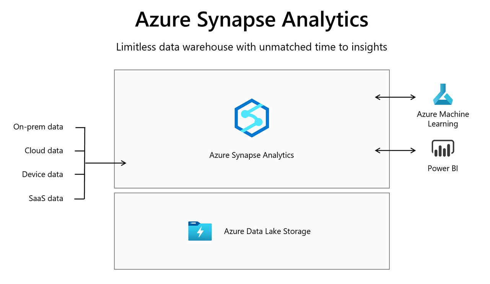

# Azure Synapse in a day demos - Infrastructure

## Overview

This is a hands-on lab for infrastructure, telecommunications, transportation, and manufacturing using Azure Synapse Analytics. It provides step-by-step procedures for basic analysis platform construction, IoT sensor data visualization, and predictive maintenance features.

## Building analytic solutions with Azure Synapse Analytics (Basic)

### About the latest data analysis infrastructure

The modern data analytics infrastructure, called the Modern Data Warehouse pattern, is based on the following points to address big data:

- Scalability

    By focusing on a managed infrastructure of PaaS, scalability that is difficult to get on-premises can be achieved. By incorporating a distributed processing infrastructure such as Spark, data processing in petabytes can be performed quickly.

- Use of data lakes

    The data lake accumulates unstructured data, such as JSON and image data. By implementing structured processing by distributed processing, visualization of data that has been difficult to use in the past and the use of AI will be promoted.

In traditional Azure data analytic infrastructures, the solution was for architects to combine PaaS such as Azure Data Factory, Azure Databricks, Azure SQL Data Warehouse, and Azure Data Lake Storage to accommodate a variety of workloads.

**Traditional Azure analytic infrastructure configuration**

With Azure Synapse Analytics, enjoy advantages of traditional scalable cloud data analytic infrastructures while:

- Building analytical infrastructures more quickly
- Reducing infrastructure complexity
- Reducing costs and improving development efficiency with integrated workspace and management screen

**Azure Synapse Analytics**

### Scenario

Build a flight delay visualization solution. With Azure Synapse Analytics, an analytic infrastructure can be built in a short time frame.

This lab will guide you through the basic deployment of Azure Synapse Analytics and creating DWH, and practicing GUI-based distributed ETL processing and reporting.

### Hands-on architecture

You will configure an architecture such as the following:

To build the architecture, complete the following tasks:

1. Deploy Azure Synapse Analytics
2. Create a link between flight delay data in the data lake
3. Create a SQL Pool
4. Create distributed ETL processing in the GUI with Mapping Data Flow
5. Visualize flight delay

### How to get started with a provided lab environment

1. If you are using a hosted CloudLabs lab environment, you will find your environment details in the email address you provided during registration. You can also find the information by selecting the **Environment Details** tab **(1)** on the landing page for the `Azure Synapse in A Day - Fraud detection` lab.

   Use the buttons **(2)** to copy your username and password when prompted to log in to the Azure portal and Power BI account. The **UniqueId (3)** is referenced throughout the lab guide and is used as part of resource naming for the Azure artifacts. When you need to sign in to the lab VM, use the provided **VM username and password (4)** after connecting to the **VM DNS name (5)** with your remote connection application, such as RDP.

2. When you need to log in to the lab VM, select the **Virtual Machines** tab **(1)** and check the VM status **(2)**. If the VM is **deallocated**, you must start it by selecting the **Start** button **(3)** under Actions.

