# Azure Synapse in a day demos - Intelligent retail

- [Azure Synapse in a day demos - Intelligent retail](#azure-synapse-in-a-day-demos---intelligent-retail)
  - [Overview](#overview)
  - [What we will do in the lab](#what-we-will-do-in-the-lab)
    - [Part 1: Data collection](#part-1-data-collection)
    - [Part 2: Data aggregation](#part-2-data-aggregation)
    - [Part 3: Data Analysis](#part-3-data-analysis)
    - [Part 4: Security](#part-4-security)
    - [Part 5: Data visualization](#part-5-data-visualization)
  - [Hands-on lab story description](#hands-on-lab-story-description)
  - [Hands-on environment](#hands-on-environment)
  - [Exercise 0: Download lab files](#exercise-0-download-lab-files)
  - [Exercise 1: Environment setup](#exercise-1-environment-setup)
    - [Task 1: Create an Azure Synapse workspace](#task-1-create-an-azure-synapse-workspace)
    - [Task 2: Set up blob data owner](#task-2-set-up-blob-data-owner)
    - [Task 3: Set up user access administrator](#task-3-set-up-user-access-administrator)
    - [Task 4: Create a SQL pool](#task-4-create-a-sql-pool)
    - [Task 5: Create an Apache Spark pool](#task-5-create-an-apache-spark-pool)
    - [Task 6: Prepare a Virtual Machine to run data generator and Power BI Desktop](#task-6-prepare-a-virtual-machine-to-run-data-generator-and-power-bi-desktop)
    - [Task 7: Download lab files](#task-7-download-lab-files)
    - [Task 8: Log in to Synapse Studio](#task-8-log-in-to-synapse-studio)
  - [Exercise 2: Data collection](#exercise-2-data-collection)

## Overview

Azure Synapse Analytics (hereafter Synapse) is an evolution of the Azure SQL Data Warehouse and a data analytics platform with conventional data warehouse functionality in addition to integration of certain functionality related to data analysis, such as data integration, distributed processing, BI, and machine learning.

In the past, each function, from data collection and processing to analysis and visualization, had to be built individually, but if you take advantage of Synapse, you can achieve all of this on the same platform.

In this classroom seminar, you studied Synapse conceptually by learning functional overviews and usage scenarios. With this hands-on training, we hope that you will further deepen your understanding of its features by building a data analytics platform on Synapse following stories as well as embodying actual usage concepts from the distribution industry.

## What we will do in the lab

This hands-on training consists of five parts, and by having you perform all the parts, you will gain a comprehensive understanding of the features of Synapse. An overview of each of the parts is provided below.

### Part 1: Data collection

Using IoT Hub and Stream Analytics, you will collect data from IoT devices, and store it in file format in Data Lake Storage.

### Part 2: Data aggregation

You will process data stored in Data Lake Storage in various formats using data flow to process it for easy handling in subsequent processing. In addition, you will aggregate the processed data with distributed processing using Spark and load it into a data warehouse (SQL pool) for analysis. You will also automate these flows using a pipeline.

### Part 3: Data Analysis

Using SQL on-demand, you will explore and analyze data stored in Data Lake Storage in various formats.
In addition, you will use machine learning models to make demand forecasts from large-scale data.

### Part 4: Security

To use Synapse Analytics securely, you will learn about the network settings and access rights settings.

### Part 5: Data visualization

Using a BI tool (Power BI), you will visualize aggregate data stored in the data warehouse to make it easier for your business to use.

## Hands-on lab story description

In a supermarket where the CTC Smart Shelf is located, real-time links to Synapse of customer behavior in front of the shelf and personal attribute data obtained from the shelf makes individual optimized marketing and real-time, multi-faceted analysis possible. In addition, by associating weather data and other open data linked externally with a variety of data obtained from the store and analyzing it in a machine learning model, you can also forecast demand.

![A smart shelf is a next-generation display case equipped with an AI camera and a weight sensor on the shelf itself. The AI camera acquires customer attributes, such as age, gender, and length of stay (age and gender are estimated by Cognitive Service Face API). The weight sensor acquires customer behavior, such as picking up and returning goods to the shelf. Based on this information, analysis of the behavior and attributes of customers that pick up and return home with products (= customers who make purchases) is performed, making next-generation in-store analysis possible. Based on customer information and sales information, information is distributed interactively to the display and electronic shelf tags mounted on the shelf to enable promotions, such as dynamic pricing and personalized marketing.](media/story-smart-shelf-description.png "What is CTC Smart Shelf?")

## Hands-on environment

The following is a diagram of the data analytics infrastructure that you will build in this hands-on training:

## Exercise 0: Download lab files

## Exercise 1: Environment setup

Time required: 20 minutes

To perform this hands-on training, you will prepare the following items in this exercise:

- Create an Azure Synapse workspace
- Create a SQL pool
- Create an Apache Spark pool
- Install Power BI Desktop

### Task 1: Create an Azure Synapse workspace

1. Navigate to the Azure portal (<https://portal.azure.com>) to create the Azure Synapse Analytics workspace.

2. In the search menu, type **Synapse**, then select **Azure Synapse Analytics (workspaces preview)**.

    

3. Select **Add**.

    

4. In the `Create Synapse workspace` form, enter the values shown in the table below. For the Azure Data Lake Storage Gen2 account name, select **Create new**, enter the account name, then select **OK**.

    

    | Parameters | Settings | Remarks |
    | --- | --- | --- |
    | Subscription | Any | Select the Azure subscription used for this lab. |
    | Resource group | `synapse-lab-retail` | Select **Create new**, then enter the name. |
    | Workspace name | `synapselabretail` + your initials + `asws` (example: `synapselabretailjdhasws`) | Lowercase alphanumeric characters only |
    | Region | Select the region closest to you, such as `West US`. | |
    | Select Data Lake Storage Gen2 | From subscription | Default settings |
    | Account name | `synapselabretail` + your initials + `adls` (example: `synapselabretailjdhadls`) | Select **Create new** (lowercase alphanumeric characters only) |

5. Select **Create new** for `File system name`, type **datalake** in the name field, then select **OK**.

    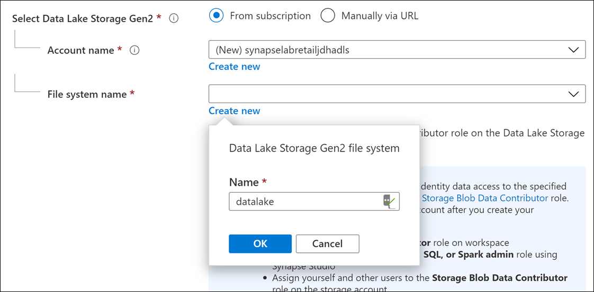

6. Check the `Assign myself the Storage Blob Data Contributor role` checkbox, then select **Next: Security**.

    

    > **Role of storage in Synapse workspace**
    >
    > Azure Data Lake Storage Gen2 (ADLS Gen2) selected when creating the Synapse workspace is considered the workspace's primary storage account, and it is used to store backing data files for Synapse SQL Serverless (SQL on-demand) and Spark tables, as well as Spark job execution logs.
    >
    > You can also access files in storage from SQL on-demand and Apache Spark directly for processing.

7. In the `Security` form, enter the values shown in the table below, then select **Next: Networking**.

    

    | Parameters | Settings | Remarks |
    | --- | --- | --- |
    | Admin username | Any | Select the Azure subscription used for this lab. |
    | Password | `handson_P@ssw0rd` | Enter the password. |
    | Confirm password | `handson_P@ssw0rd` | Re-enter the same password. |
    | System assigned managed identity | Check the box (On) | Allow pipelines running as the workspace's system assigned identity to access SQL pools. |

8. In the `Networking` form, enter the values shown in the table below, then select **Review + create**.

    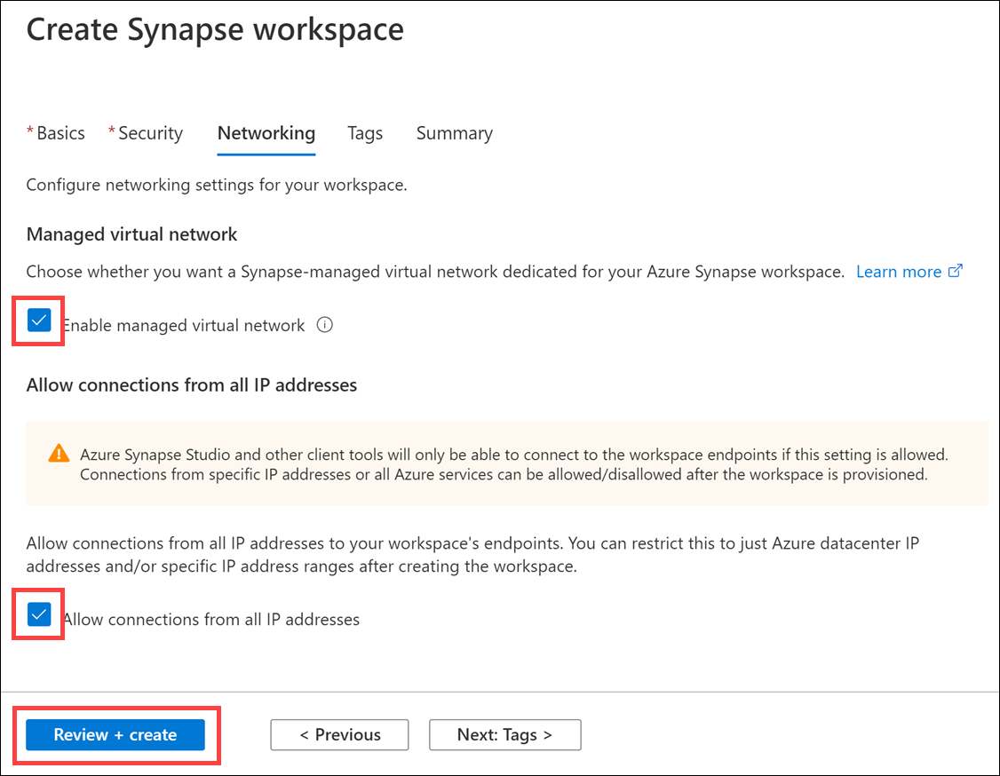

    | Parameters | Settings |
    | --- | --- |
    | Enable managed virtual network | Check the box (On) |
    | Allow connections from all IP addresses | Check the box (On) |

9. Review the settings, then select **Create**. It takes around five minutes to create the workspace.

    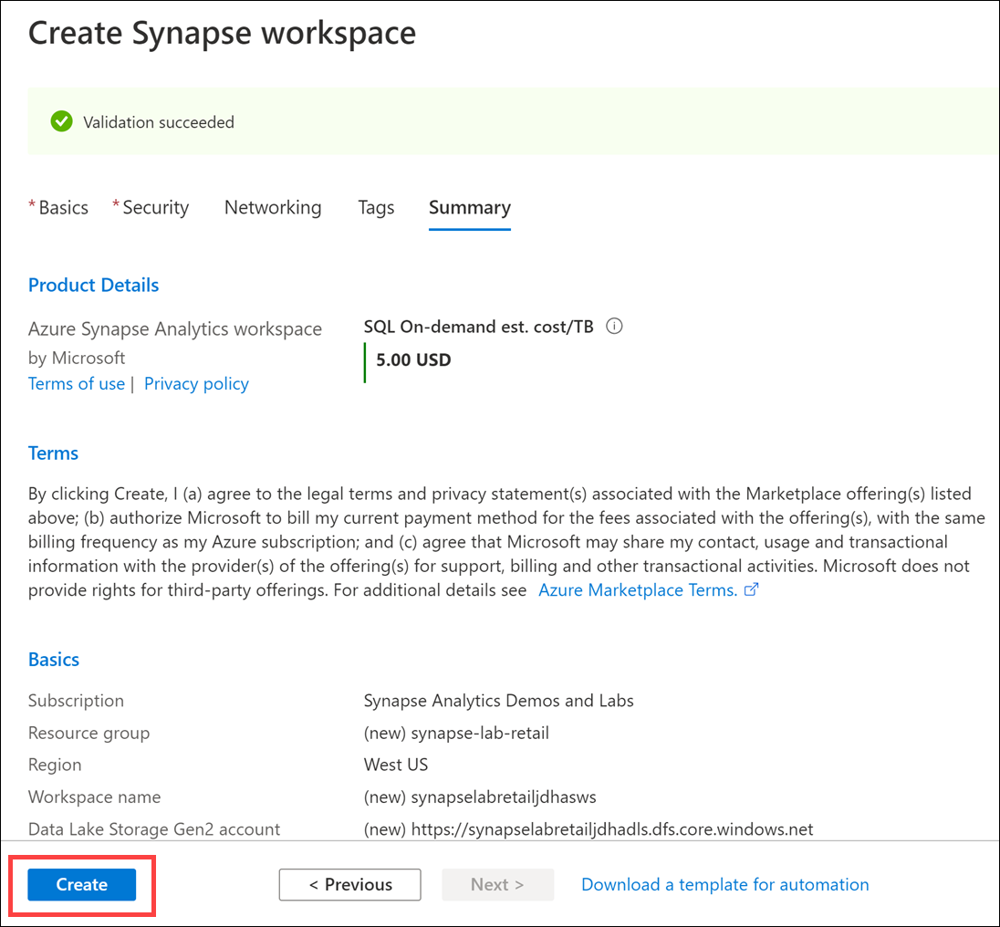

### Task 2: Set up blob data owner

Data access permissions on the data lake must be set separately from the resource's permissions.

1. When the Azure Synapse Analytics workspace deployment completes, navigate to the `synapse-lab-retail` resource group. In the Azure portal, use the top search bar to search for `synapse-lab-retail`, then select the **synapse-lab-retail** resource group in the search results under **Resource Groups**.

    

2. Within the resource group, select the storage account you created when you deployed the Azure Synapse Analytics workspace.

    

3. Within the storage account, select **Access control (IAM)**. Select **+ Add**, then **Add role assignment**.

    

4. Select the **Storage Blob Data Owner** role. Select **Azure AD user, group, or service principal** under assign access to. Search for and select your Azure account, then select **Save**.

    

### Task 3: Set up user access administrator

1. Return to the `synapse-lab-infrastructure` resource group and select the Azure Synapse Analytics workspace within.

    

2. Within the Synapse workspace, select **Access control (IAM)**. Select **+ Add**, then **Add role assignment**.

    

3. Select the **User Access Administrator** role. Select **User, group, or service principal** under assign access to. Search for and select your Azure account, then select **Save**.

    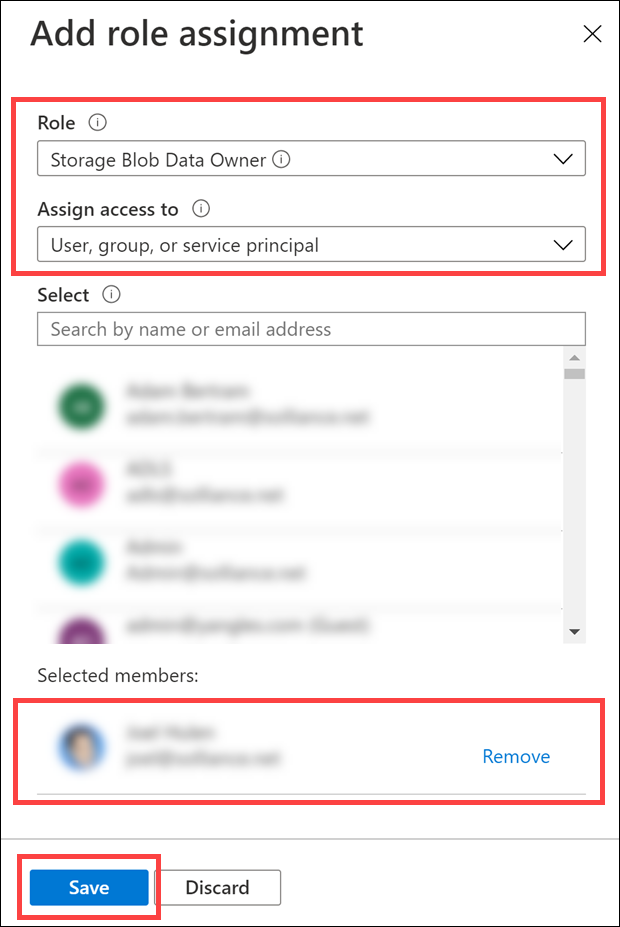

### Task 4: Create a SQL pool

1. Return to the `synapse-lab-retail` resource group and select the Azure Synapse Analytics workspace within.

    

2. Select **SQL pools** in the left-hand menu, then select **+ New**.

    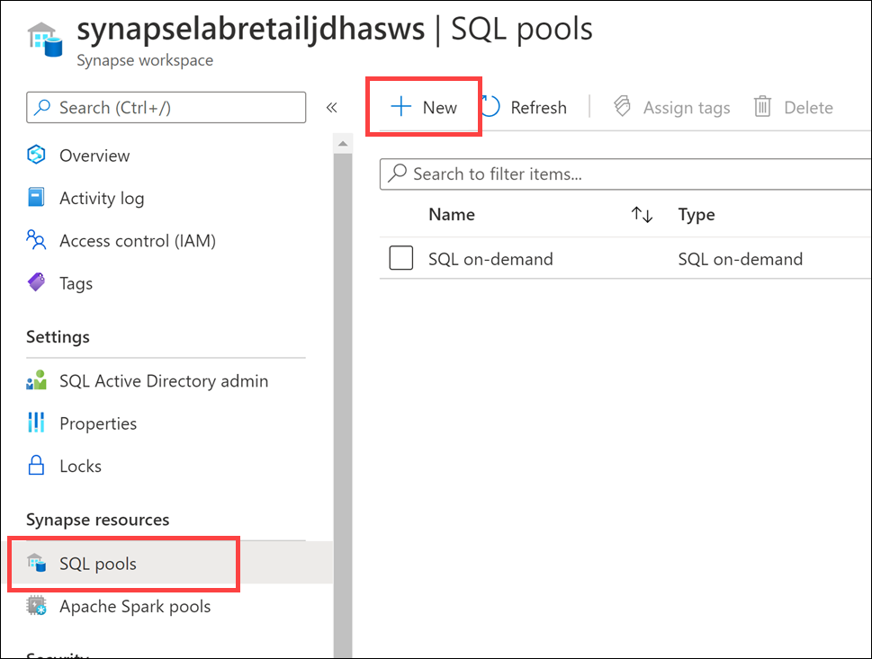

3. Enter **`SqlPool`** for the name and set the performance level to **DW100c**. Select **Review + create**.

    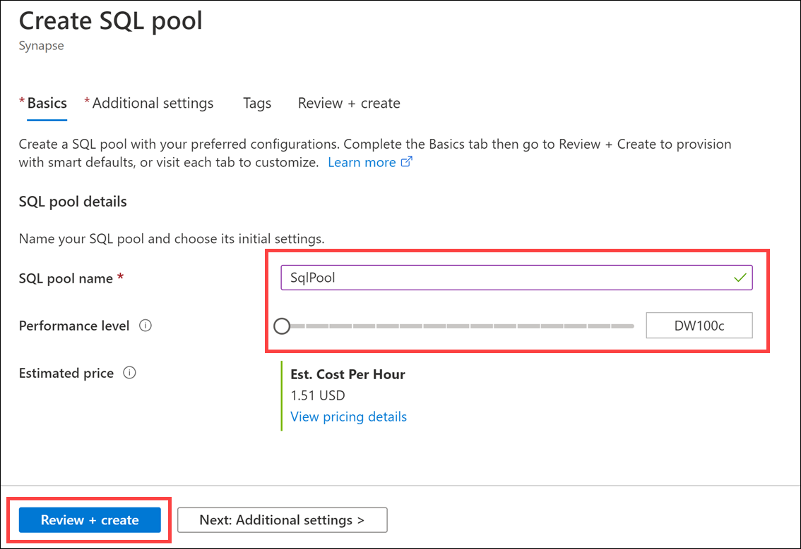

4. Confirm the settings, then select **Create**.

    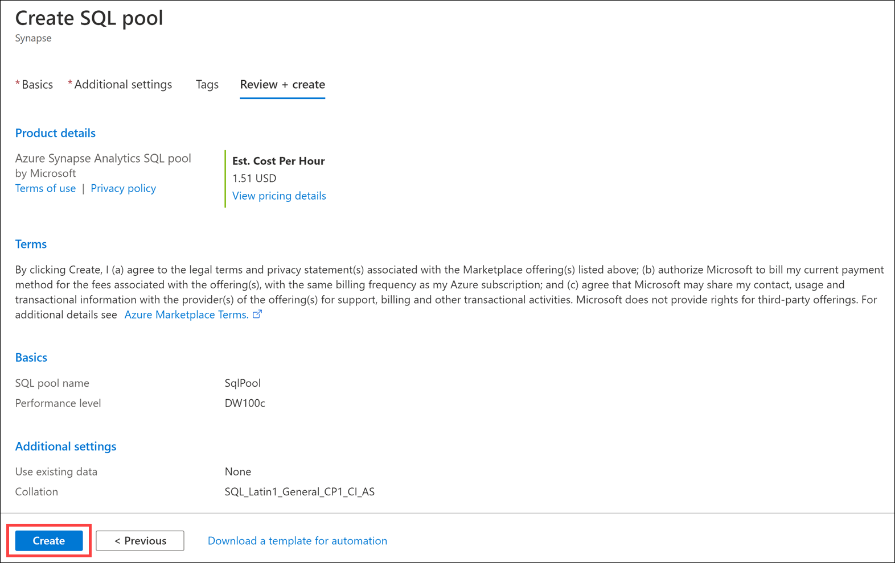

### Task 5: Create an Apache Spark pool

1. Return to the `synapse-lab-retail` resource group and select the Azure Synapse Analytics workspace within.

    

2. Select **Apache Spark pools** on the left-hand menu, then select **+ New**.

    

3. Enter **`SparkPool`** for the name, select the **Small (4 vCPU / 32 GB)** node size, and enable **Autoscale**. Set the number of nodes to a minimum of **3** and a maximum of **10**. Select **Review + create**.

    

4. Confirm the settings, then select **Create**.

    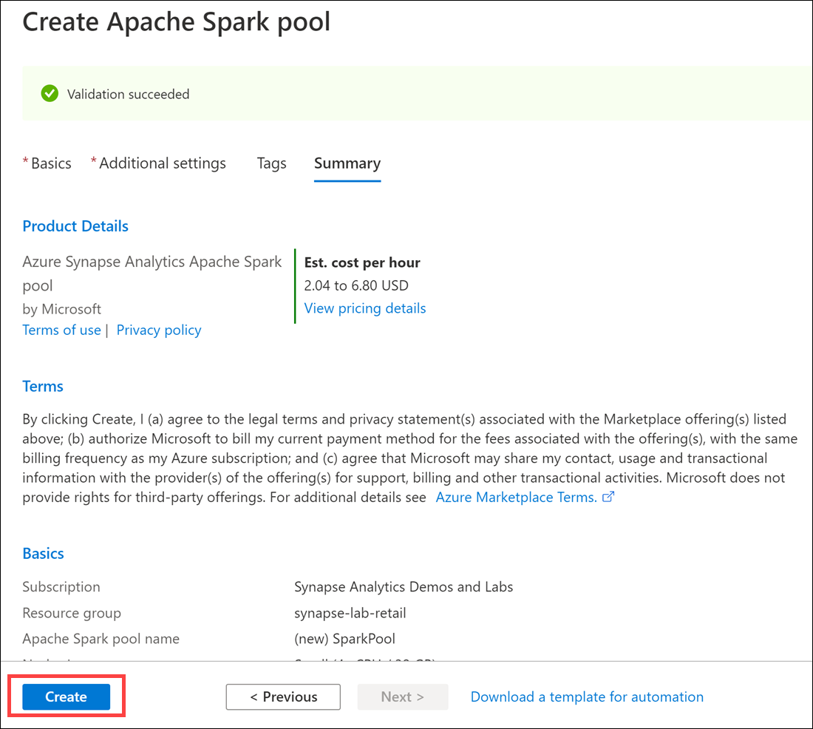

### Task 6: Prepare a Virtual Machine to run data generator and Power BI Desktop

To proceed with the steps described in this hands-on training, you need to install Node.js for the data generator, and need to use the Power BI Desktop app for Windows 10. In this step, you will create a virtual machine running Windows 10, install Node.js, then install Power BI.

1. In the [Azure portal](https://portal.azure.com), type in "virtual machines" in the top search menu and then select **Virtual machines** from the results.

    

2. Select **+ Add** on the Virtual machines page and then select the **Virtual machine** option.

3. In the **Basics** tab, complete the following:

   | Field                          | Value                                              |
   | ------------------------------ | ------------------------------------------         |
   | Subscription                   | _select the appropriate subscription_              |
   | Resource group                 | _select `synapse-lab-retail`_                      |
   | Virtual machine name           | _`powerbi` (or unique name if not available)_      |
   | Region                         | _select the resource group's location_             |
   | Availability options           | _select `No infrastructure redundancy required`_   |
   | Image                          | _select `Windows 10 Pro, Version 1809 - Gen1`_     |
   | Azure Spot instance            | _select `No`_                                      |
   | Size                           | _select `Standard_D2s_v3`_                         |
   | Username                       | _select `powerbiuser`_                             |
   | Password                       | _enter a password you will remember_               |
   | Public inbound ports           | _select `Allow selected ports`_                    |
   | Select inbound ports           | _select `RDP (3389)`_                              |
   | Licensing                      | _select the option to confirm that you have an  eligible Windows 10 license with multi-tenant hosting rights._ |

   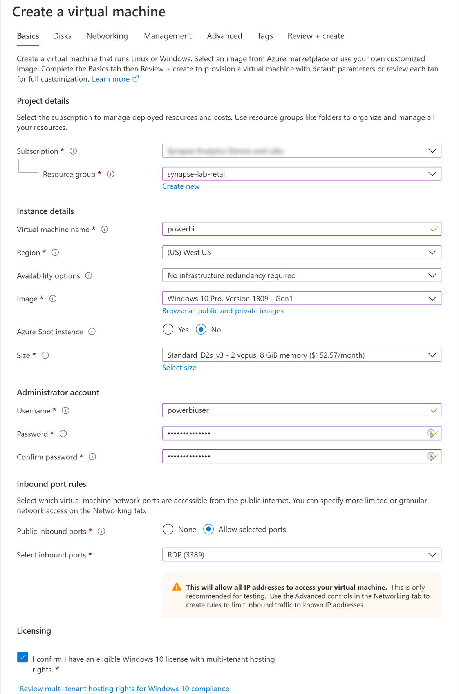

4. Select **Review + create**. On the review screen, select **Create**. After the deployment completes, select **Go to resource** to go to the virtual machine.

    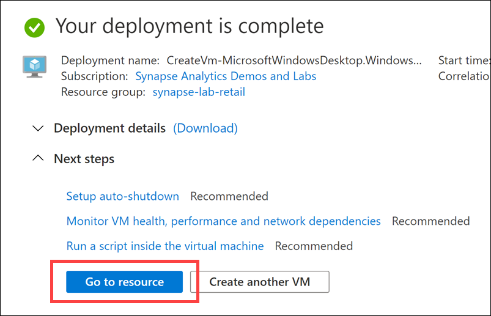

5. Select **Connect** from the actions menu and choose **RDP**.

    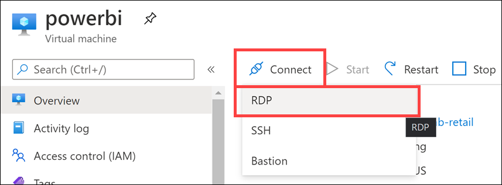

6. On the **Connect** tab, select **Download RDP File**.

    

7. Open the RDP file and select **Connect** to access the virtual machine. When prompted for credentials, enter `powerbiuser` for the username and the password you chose. Select the option to allow the security certificate when prompted.

    

8. From the following URL, go to the Power BI Desktop download site and select **Download free**: Power BI Desktop: <https://powerbi.microsoft.com/desktop/>

    

9. Install the software from the Microsoft store.

    

### Task 7: Download lab files

1. From your lab VM, navigate to <https://solliancepublicdata.blob.core.windows.net/synapse-in-a-day/retail/handson.zip> to download the ZIP file for this lab.

2. Navigate to the folder to which you downloaded the file. Right-click on the `handson.zip` file, then select **Extract All...**.

    

3. Change the destination folder path to **`C:\handson`**, then click **Extract**.

    

4. You should see three folders in the `C:\handson` directory after extracting the files.

    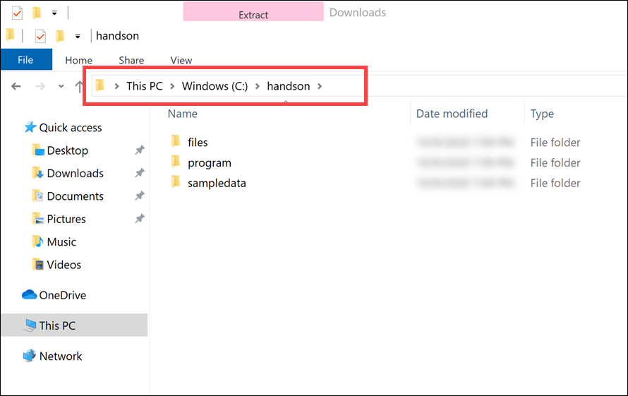

### Task 8: Log in to Synapse Studio

1. Return to the `synapse-lab-retail` resource group and select the Azure Synapse Analytics workspace within.

    

2. In the **Overview** blade, select the **Workspace web URL** or **Launch Synapse Studio** to navigate to Synapse Studio for this workspace.

    

    After authenticating your account, you should see the Synapse Studio home page for your workspace.

    

3. If you see the Getting started dialog, select **Close**.

    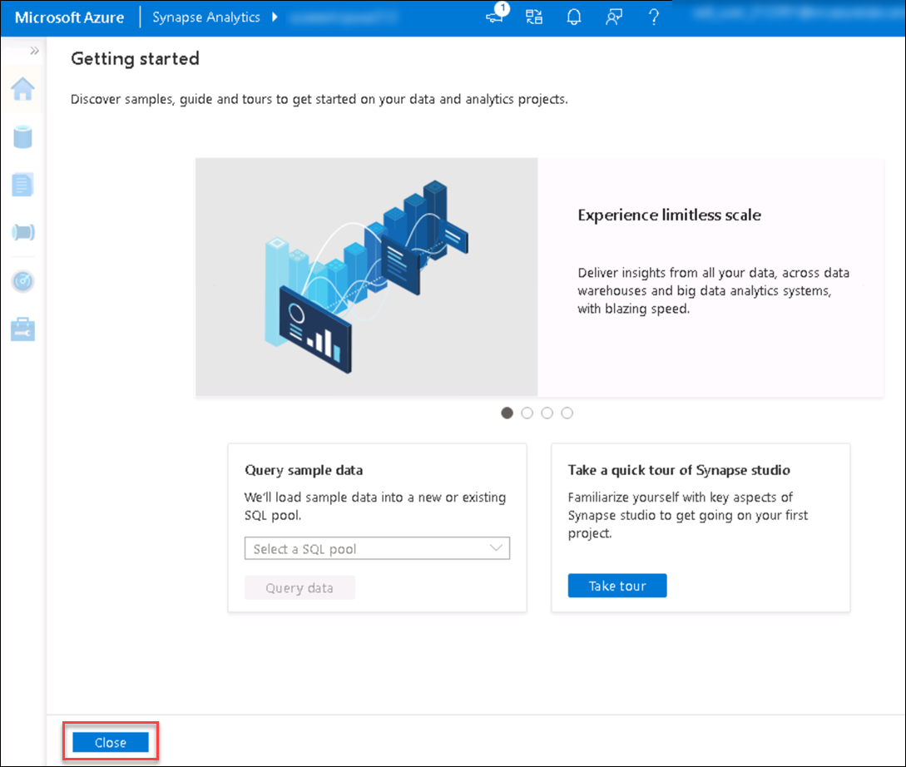

## Exercise 2: Data collection

Time required: 20 minutes

In data collection, you will collect and process stream data flowing from IoT devices in real time and store it in the data lake.

You will learn:

- **Data Lake Storage construction**: Build a data lake to store collected data.

- **IoT Hub construction**: Build a gateway to connect devices in Azure end-to-end and enable secure two-way communication.

- **Stream Analytics construction**: Build workload to analyze and process streaming data flowing through IoT Hub in real time.

- **Send streaming data from IoT devices**: Using IoT Hub client, implement processing to send messages from a device to IoT Hub.

