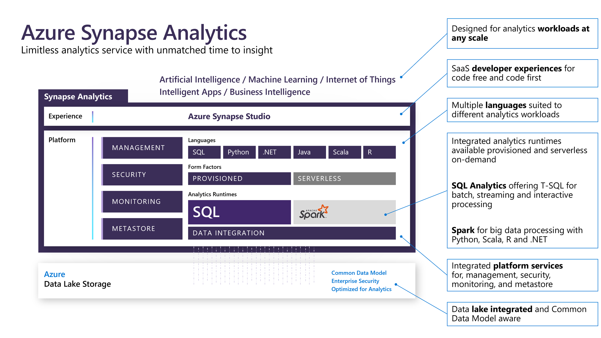
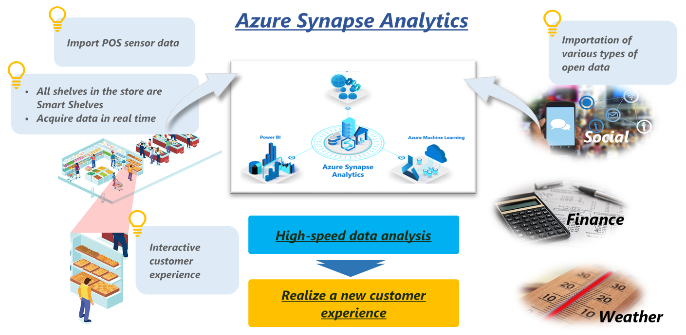
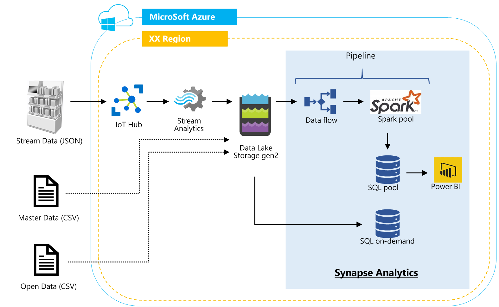

## Overview

Azure Synapse Analytics (hereafter Synapse) is an evolution of the Azure SQL Data Warehouse and a data analytics platform with conventional data warehouse functionality in addition to integration of certain functionality related to data analysis, such as data integration, distributed processing, BI, and machine learning.

In the past, each function, from data collection and processing to analysis and visualization, had to be built individually, but if you take advantage of Synapse, you can achieve all of this on the same platform.

In this classroom seminar, you studied Synapse conceptually by learning functional overviews and usage scenarios. With this hands-on training, we hope that you will further deepen your understanding of its features by building a data analytics platform on Synapse following stories as well as embodying actual usage concepts from the distribution industry.

## What we will do in the lab

This hands-on training consists of five parts, and by having you perform all the parts, you will gain a comprehensive understanding of the features of Synapse. An overview of each of the parts is provided below.

### Part 1: Data collection

Using IoT Hub and Stream Analytics, you will collect data from IoT devices, and store it in file format in Data Lake Storage.

### Part 2: Data aggregation

You will process data stored in Data Lake Storage in various formats using data flow to process it for easy handling in subsequent processing. In addition, you will aggregate the processed data with distributed processing using Spark and load it into a data warehouse (SQL pool) for analysis. You will also automate these flows using a pipeline.

### Part 3: Data Analysis

Using SQL on-demand, you will explore and analyze data stored in Data Lake Storage in various formats.
In addition, you will use machine learning models to make demand forecasts from large-scale data.

### Part 4: Security

To use Synapse Analytics securely, you will learn about the network settings and access rights settings.

### Part 5: Data visualization

Using a BI tool (Power BI), you will visualize aggregate data stored in the data warehouse to make it easier for your business to use.

## Hands-on lab story description

In a supermarket where the CTC Smart Shelf is located, real-time links to Synapse of customer behavior in front of the shelf and personal attribute data obtained from the shelf makes individual optimized marketing and real-time, multi-faceted analysis possible. In addition, by associating weather data and other open data linked externally with a variety of data obtained from the store and analyzing it in a machine learning model, you can also forecast demand.

![A smart shelf is a next-generation display case equipped with an AI camera and a weight sensor on the shelf itself. The AI camera acquires customer attributes, such as age, gender, and length of stay (age and gender are estimated by Cognitive Service Face API). The weight sensor acquires customer behavior, such as picking up and returning goods to the shelf. Based on this information, analysis of the behavior and attributes of customers that pick up and return home with products (= customers who make purchases) is performed, making next-generation in-store analysis possible. Based on customer information and sales information, information is distributed interactively to the display and electronic shelf tags mounted on the shelf to enable promotions, such as dynamic pricing and personalized marketing.](media/story-smart-shelf-description.png "What is CTC Smart Shelf?")

## Hands-on environment

The following is a diagram of the data analytics infrastructure that you will build in this hands-on training:

